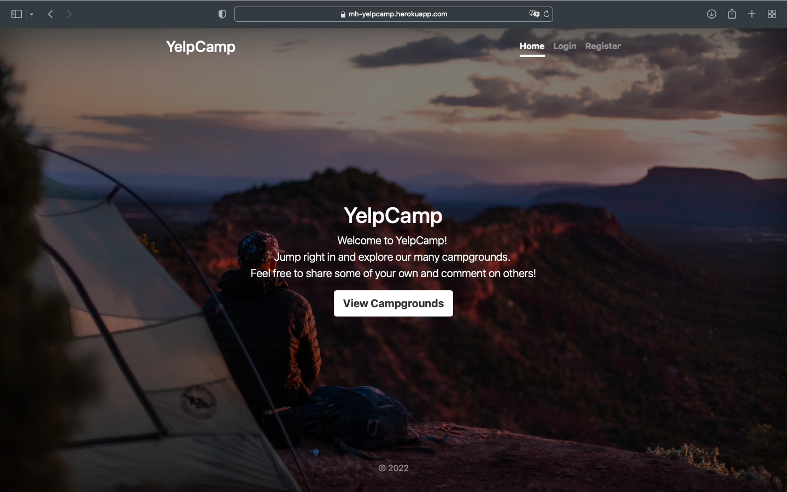
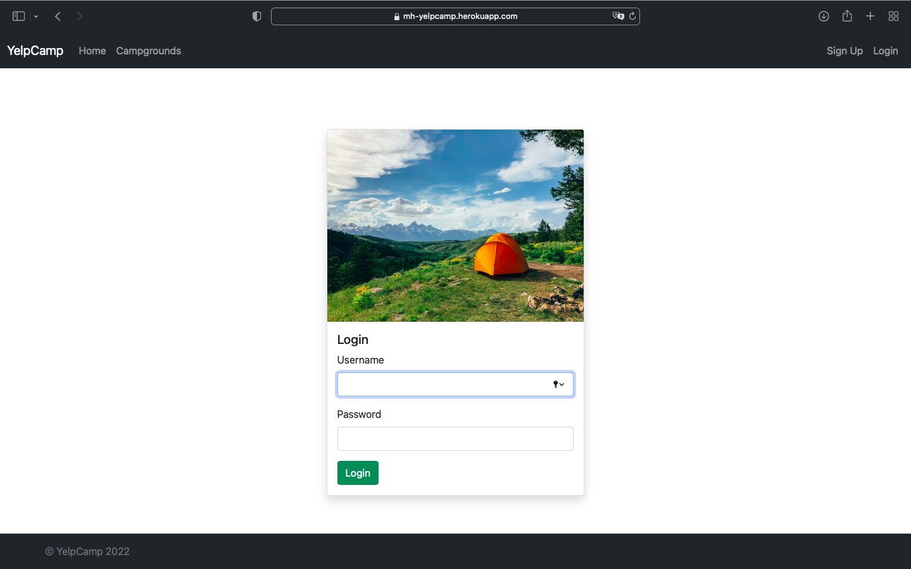
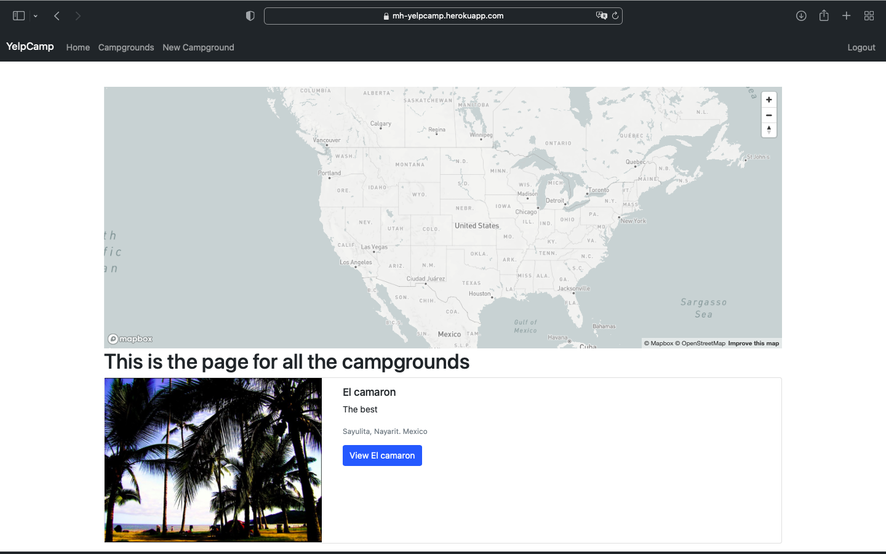
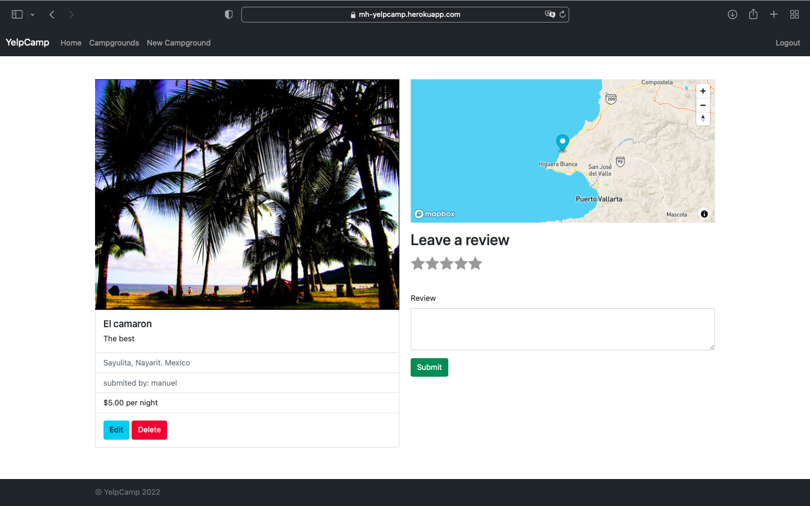
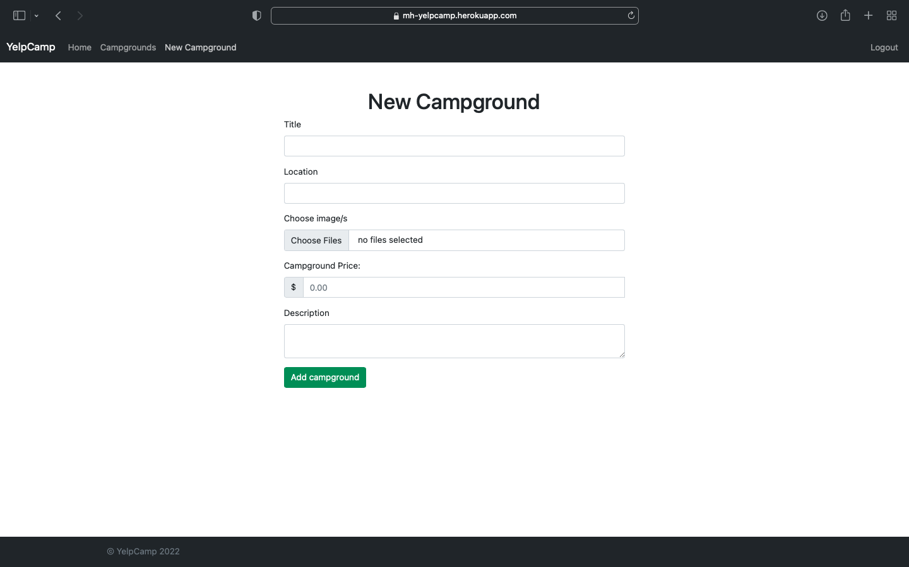

# Yelpcamp 🏕️

_A Full-Stack CRUD App Built with Node.js, Express, and MongoDB_

---

## 📘 Overview

Yelpcamp is a full-stack web application built during my full-stack developer program. It allows users to share and review campground locations around the world — similar to Yelp, but focused on outdoor adventures. The app supports full CRUD functionality, user authentication, authorization, interactive maps, and image uploads.

---

### App Screenshots :

1. Home page.

2. Registration page

3. Login page

4. All posts page

5. One post page

6. Edit campground page

7. New campground page

---

## 🛠️ Tech Stack

- **Frontend:** HTML, CSS, JavaScript, Bootstrap
- **Backend:** Node.js, Express
- **Database:** MongoDB with Mongoose
- **Features:**
  - Full CRUD functionality
  - RESTful routing
  - User registration & login (authentication)
  - Role-based access (authorization)
  - Image/file upload with Multer & Cloudinary
  - Interactive maps with Mapbox
  - Flash messaging & error handling

---

## 🚀 Getting Started

You can try out the live version of the app [here](https://yelpcamp-murex-ten.vercel.app/home)

---

## 📚 What I Learned

This was one of the first full-stack applications I built during my full-stack web development program. It helped solidify my understanding of:
RESTful API design
Server-side routing and middleware
MongoDB and schema design with Mongoose
User auth with Passport.js
Working with third-party APIs and services
